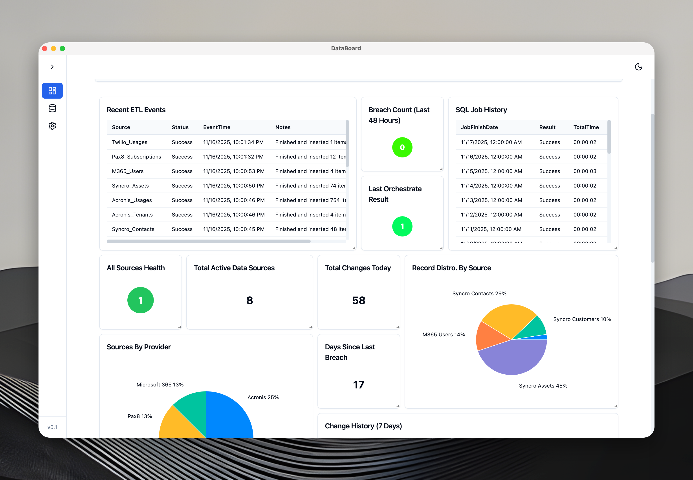
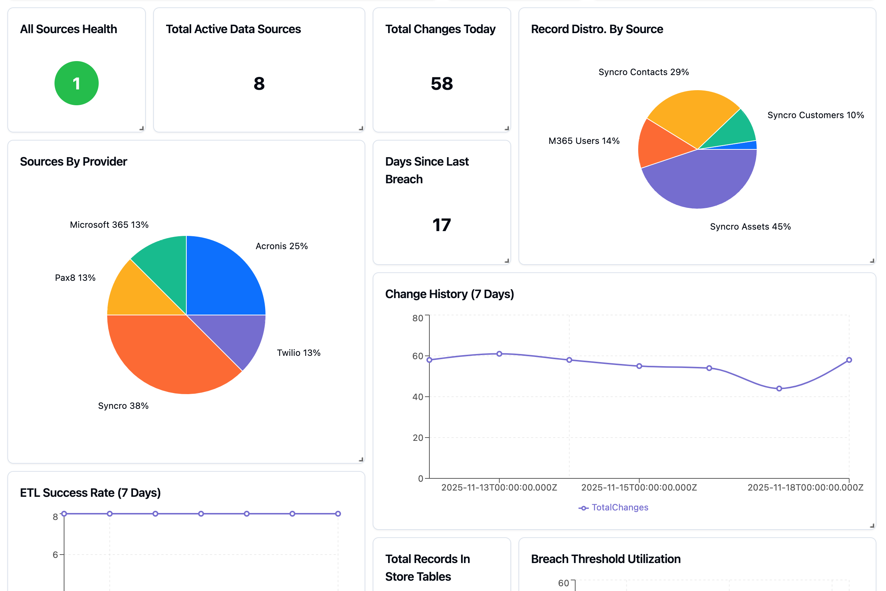
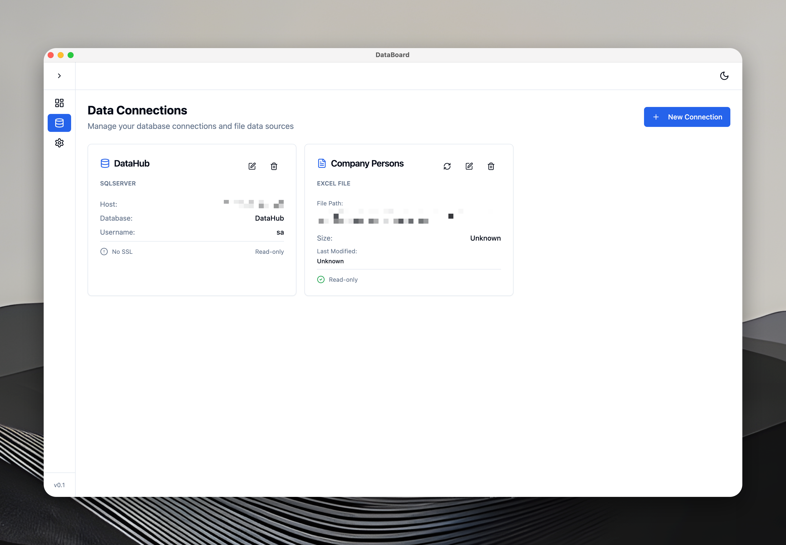
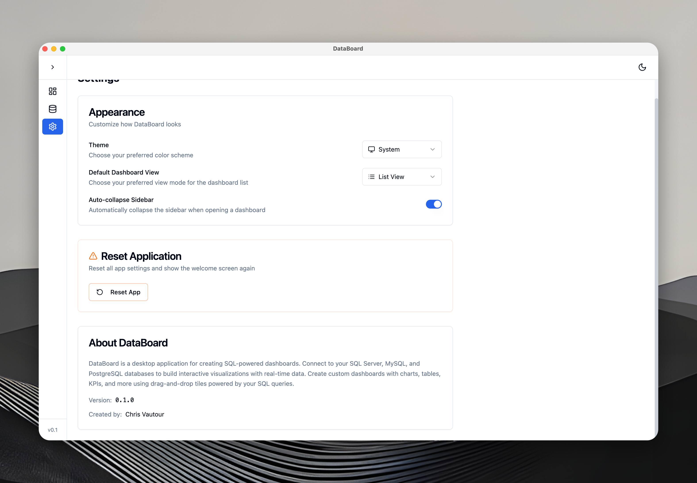

# DataBoard

**DataBoard** is a powerful desktop application for creating interactive SQL-powered dashboards. Connect to your SQL Server, MySQL, and PostgreSQL databases and visualize your data with beautiful charts, tables, and KPIs.

## Features

### 🔌 Multi-Database Support
- **SQL Server** - Connect using standard authentication or Windows Integrated Authentication
- **MySQL** - Support for MySQL 5.7+ and MariaDB
- **PostgreSQL** - Full support for PostgreSQL 10+
- Works seamlessly with remote databases via VPN or ZeroTier

### 📊 Rich Visualizations
- **Interactive Charts** - Line charts, bar charts, and pie charts with automatic series detection
- **Data Tables** - Scrollable tables with formatted values and sticky headers
- **KPI Tiles** - Large value displays for key metrics
- **Status Indicators** - Color-coded status tiles
- **Gauges** - Visual progress and percentage displays

### 🎨 Drag-and-Drop Dashboard Builder
- Intuitive grid layout with 12-column responsive design
- Resize and rearrange tiles with ease
- Auto-refresh intervals for real-time data
- Multiple dashboards with organization folders
- Save and restore custom layouts

### 🔐 Secure Credential Management
- Passwords encrypted using OS-level keychain integration
- Secure storage with Electron's `safeStorage` API
- No plain-text credentials in configuration files
- Connection pooling for optimal performance

### ⚡ Real-Time Data
- Configurable auto-refresh intervals per tile
- Live query execution with connection pooling
- Instant visualization updates
- Query history and audit logging

## Screenshots

### Connection Management
Easily manage multiple database connections with secure credential storage.

### Tile Editor
Create tiles with a powerful query editor and instant visualization preview.

### Settings
Customize your DataBoard experience with flexible configuration options.

## Installation

### macOS (Apple Silicon)

1. Download the latest `.dmg` file from [Releases](https://github.com/advenimus/databoard/releases)
2. Open the downloaded DMG file
3. Drag **DataBoard** to your Applications folder
4. Launch DataBoard from Applications

**Important for macOS users:**
- First launch: Right-click the app and select "Open" to bypass Gatekeeper
- You may need to grant Local Network permission in System Settings → Privacy & Security → Local Network

### Windows

**Option 1: Installer (Recommended)**
1. Download `DataBoard Setup {version} x64.exe` from [Releases](https://github.com/advenimus/databoard/releases)
2. Run the installer (no admin rights required)
3. Launch DataBoard from the Start Menu or desktop shortcut

**Option 2: Portable (No Installation)**
1. Download `DataBoard-{version}-win.zip` from [Releases](https://github.com/advenimus/databoard/releases)
2. Extract the ZIP file to any folder
3. Run `DataBoard.exe` directly

**Note:** User data is stored in `%APPDATA%\DataBoard` regardless of installation method.

## System Requirements

### Minimum Requirements
- **macOS**: macOS 11.0 (Big Sur) or later, Apple Silicon (M1/M2/M3)
- **Windows**: Windows 10 or later (64-bit)
- **Memory**: 4 GB RAM
- **Storage**: 500 MB available disk space

### Network Requirements
- Access to remote SQL databases via:
  - Direct network connection
  - VPN (e.g., OpenVPN, WireGuard)
  - ZeroTier or similar mesh networking

## Quick Start

1. **Launch DataBoard** and create your first connection
2. **Add a database connection**:
   - Click "Connections" in the sidebar
   - Click "New Connection"
   - Enter your database details (host, port, database name, credentials)
   - Test the connection
3. **Create a dashboard**:
   - Click "Dashboards" in the sidebar
   - Click "New Dashboard"
   - Give it a name and description
4. **Add tiles**:
   - Open your dashboard
   - Click "Add Tile"
   - Write your SQL query
   - Choose visualization type (auto-detected by default)
   - Save and watch your data come to life!

## Supported Database Types

| Database | Authentication | Notes |
|----------|---------------|-------|
| SQL Server | Standard, Windows Auth | Requires mssql 2012+ |
| MySQL | Standard | Supports MySQL 5.7+ and MariaDB |
| PostgreSQL | Standard | Supports PostgreSQL 10+ |

## Configuration

### Database Location
By default, DataBoard stores its data in:
- **macOS**: `~/Library/Application Support/DataBoard/data/databoard.db`
- **Windows**: `%APPDATA%\DataBoard\data\databoard.db`

You can customize the database location in Settings → Database Path.

### Query History
All query executions are logged for audit purposes. View query history in the Query History section.

## Privacy & Security

- **Local-first**: All data is stored locally on your machine
- **Encrypted passwords**: Database credentials are encrypted using OS keychain
- **No telemetry**: DataBoard does not collect or transmit usage data
- **Open connections**: You control which databases to connect to

## Support

### Getting Help
- **Issues**: Report bugs or request features in [GitHub Issues](https://github.com/advenimus/databoard/issues)
- **Discussions**: Ask questions in [GitHub Discussions](https://github.com/advenimus/databoard/discussions)

### Common Issues

**macOS: "DataBoard cannot be opened"**
- Right-click the app and select "Open" instead of double-clicking
- In System Settings → Privacy & Security, click "Open Anyway"

**Windows: App won't start**
- Make sure you're running Windows 10 or later (64-bit)
- Try running as administrator if using portable version

**Connection errors**
- Verify your database server is accessible from your machine
- Check firewall rules allow outbound connections
- Confirm credentials are correct with a test connection

## Changelog

See [CHANGELOG.md](./CHANGELOG.md) for version history and release notes.

## License

DataBoard is released under the MIT License. See LICENSE file for details.

## Credits

Created by **Advenimus Software**

Built with:
- [Electron](https://www.electronjs.org/) - Cross-platform desktop framework
- [React](https://react.dev/) - UI framework
- [Redux Toolkit](https://redux-toolkit.js.org/) - State management
- [Recharts](https://recharts.org/) - Data visualization
- [better-sqlite3](https://github.com/WiseLibs/better-sqlite3) - SQLite database
- [mssql](https://github.com/tediousjs/node-mssql) - SQL Server driver
- [mysql2](https://github.com/sidorares/node-mysql2) - MySQL driver
- [pg](https://github.com/brianc/node-postgres) - PostgreSQL driver

---

**Ready to visualize your data?** [Download the latest release](https://github.com/advenimus/databoard/releases) and get started today!
